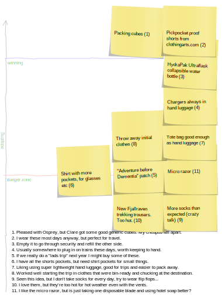

# travel-grid

Optimise your travel planning like me, with a text file you can turn into some fun sticky notes [to post on a blog or whatever](http://www.clarkeology.com/misc/travel/).

1. `./scripts/stickyGrid.js > images/travel-todo.svg # it's just html`

